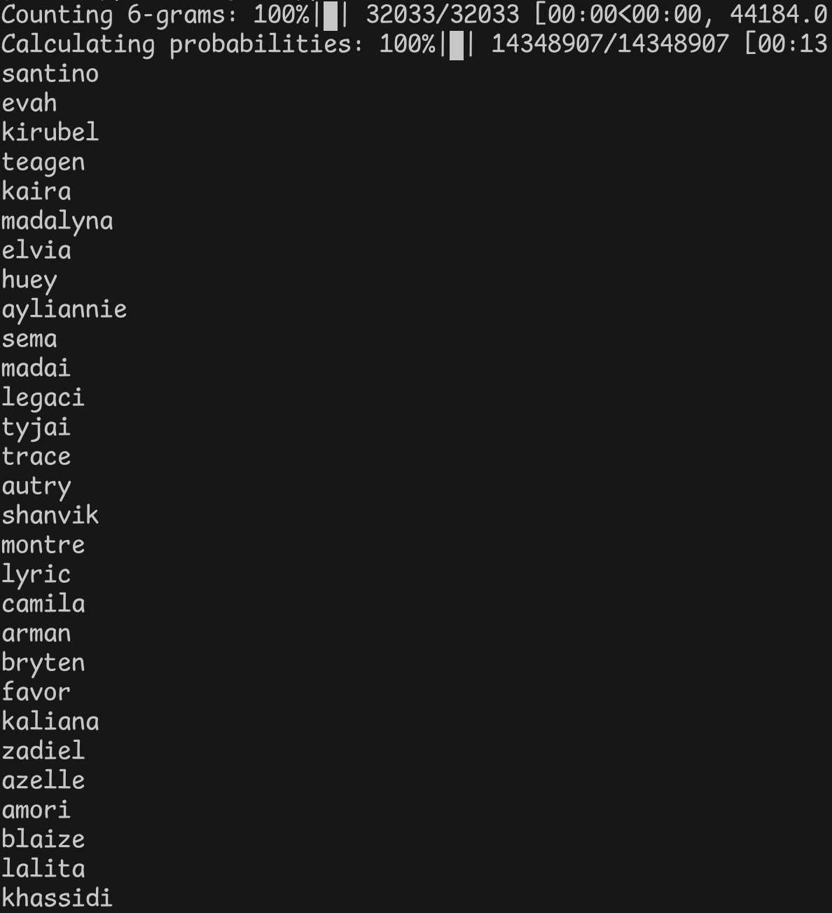

<h1>Bigram and trigram model</h1>

Basic bigram and trigram <a href="https://en.wikipedia.org/wiki/N-gram">(read...)</a> model written in Python using only numpy.

Based on <a href="https://github.com/karpathy/makemore" target="_blank">Karpathy's</a> bigram model shown in his makemore lectures.

 

 

Dependencies:

<ul>
    <li>Numpy</li>
</ul>
 

Todo:

<ul>
    <s><li>Automatic <b>n-gram</b> probability distributions generator</li></s>
</ul>